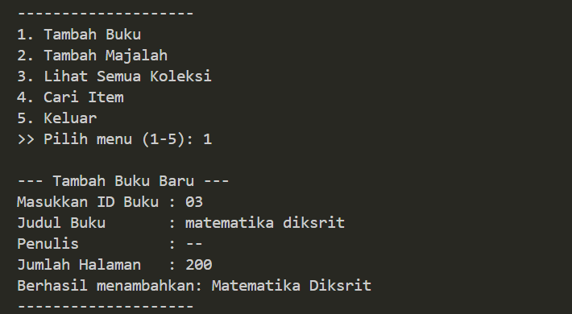

# 📚 Sistem Manajemen Perpustakaan (Python OOP)

Proyek ini adalah implementasi sistem manajemen perpustakaan berbasis CLI (Command Line Interface) yang dibangun untuk memenuhi tugas mata kuliah Pemrograman. Kode ini mendemonstrasikan penerapan pilar utama **Object-Oriented Programming (OOP)**.

## 🌟 Fitur Utama

1.  **Tambah Data**: Input buku dan majalah dengan validasi data.
2.  **Lihat Koleksi**: Menampilkan seluruh item dalam format tabel yang rapi.
3.  **Pencarian**: Fitur pencarian item berdasarkan judul atau ID.
4.  **Struktur OOP**: Menggunakan Abstract Class, Inheritance, dan Polymorphism.

## 📸 Dokumentasi Program

Berikut adalah hasil tangkapan layar (screenshot) dari fitur utama program:

### 1. Menambahkan Item Baru
Proses input data buku dan majalah ke dalam sistem.

### 2. Menampilkan Seluruh Koleksi
Output polymorphic yang membedakan detail antara Buku dan Majalah.

### 3. Pencarian Item
Mencari data spesifik menggunakan kata kunci.

## 🛠️ Konsep OOP yang Diterapkan

| Konsep | Implementasi di Kode |
| :--- | :--- |
| **Abstraction** | Class `LibraryItem` (ABC) sebagai blueprint dasar. |
| **Inheritance** | `Book` dan `Magazine` adalah turunan dari `LibraryItem`. |
| **Polymorphism**| Method `get_details()` memiliki output berbeda di tiap class. |
| **Encapsulation**| Penggunaan properti private `__collection` dan protected `_title`. |

