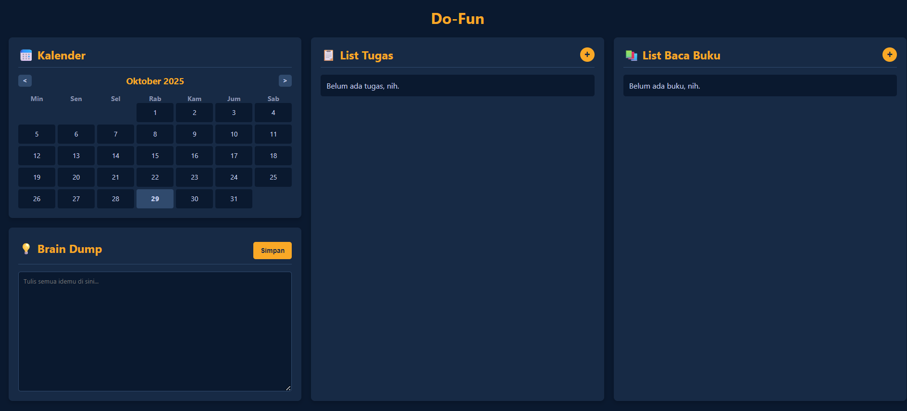

# Do-Fun: Personal Productivity Dashboard 🚀

Do-Fun adalah dashboard produktivitas pribadi yang simpel, dibuat dengan **HTML**, **CSS**, dan **JavaScript (ES6+)** murni. Aplikasi ini membantu mengelola tugas harian, daftar bacaan buku, dan mencatat ide-ide acak di satu tempat.

Semua data disimpan di `localStorage` browser, jadi data tetap aman meskipun halaman di-refresh.

## ✨ Fitur Utama

* **List Tugas:** Tambah, edit, hapus, dan tandai selesai tugas harian. Setiap tugas memiliki nama dan *deadline*.
* **List Baca Buku:** Kelola daftar bacaan (buku, webtoon, artikel) lengkap dengan target (misal: jumlah halaman) dan platform (misal: Fisik, PDF).
* **Kalender Interaktif:** Menampilkan kalender bulanan, menandai hari ini, dan memberikan indikator (titik kuning) pada tanggal yang memiliki *deadline* tugas.
* **Brain Dump:** Area teks simpel untuk mencatat ide, pemikiran, atau catatan acak dengan cepat.
* **Penyimpanan Lokal:** Semua data tugas, buku, dan *brain dump* tersimpan otomatis di `localStorage`.
* **Desain Responsif:** Tampilan dioptimalkan untuk desktop dan mobile menggunakan CSS Grid dan Media Queries.

## 📸 Tampilan Aplikasi

| Tampilan Awal | Tampilan dengan Data |
| :---: | :---: |
|  |  |

| Modal Edit Tugas | Item Selesai |
| :---: | :---: |
|  |  |

## 🛠️ Fitur ES6+ yang Diimplementasikan

Proyek ini ditulis menggunakan sintaks JavaScript modern (ES6+) untuk kode yang lebih bersih, terstruktur, dan mudah dikelola.

* **`class` & `extends` (OOP):** Menggunakan `class Item` sebagai *parent class* yang di-*extend* oleh `class Tugas` dan `class Buku` untuk pewarisan properti dan *method* (`toggleSelesai`).
* **`async` / `await`:** Digunakan untuk mengelola operasi *asynchronous* seperti `loadData` dan `saveData` (yang menyimulasikan *delay* I/O dengan `Promise` dan `setTimeout`).
* **`Promise` & `Promise.all`:** Digunakan pada fungsi `initApp` untuk memuat semua data (tugas, buku, brain dump) secara paralel sebelum me-render UI.
* **Arrow Functions (`=>`):** Digunakan secara ekstensif untuk *event listeners* dan *callback* agar lebih ringkas dan menjaga *lexical scope* `this`.
* **`const` dan `let`:** Menggantikan `var` untuk *block-scoping* variabel, membuat kode lebih aman dan mudah diprediksi.
* **Template Literals (Backticks `` ` ``):** Digunakan untuk membuat string HTML (pada fungsi `renderTugasList` dan `renderBukuList`) secara dinamis dan lebih mudah dibaca.
* **Default Parameters:** Digunakan pada *constructor* `class` (cth: `selesai = false`) untuk memberi nilai *default* pada parameter.
* **Array Destructuring:** Digunakan pada `initApp` untuk mengekstrak hasil dari `Promise.all` ke variabel individual (`[tugasData, bukuData, brainDumpData]`).
