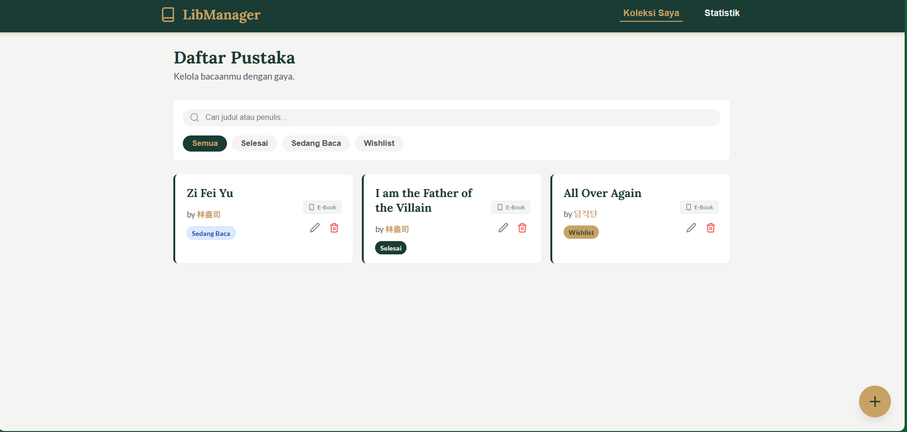
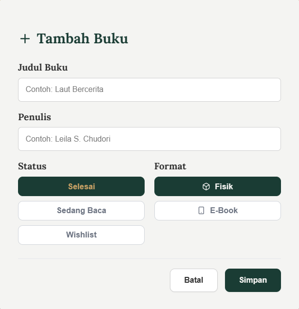
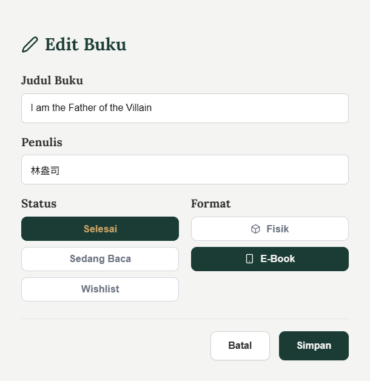
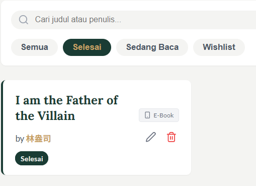

# LibManager - Personal Library Management App 📚

**LibManager** adalah aplikasi web berbasis React untuk mengelola koleksi buku pribadi. Aplikasi ini memungkinkan pengguna untuk mencatat buku, memantau status bacaan, dan melihat statistik literasi mereka dengan antarmuka yang modern dan responsif.

Dibuat untuk memenuhi Tugas Pemrograman Web Lanjut (ITERA).

---

## 📋 Deskripsi Aplikasi

LibManager dirancang untuk membantu pencinta buku melacak bacaan mereka. Data disimpan secara persisten menggunakan Browser LocalStorage, sehingga data tidak hilang saat browser ditutup.

**Fitur Utama:**
* **Manajemen Koleksi:** Tambah, Edit, dan Hapus buku.
* **Status Tracking:** Kategorikan buku (Belum Dibaca, Sedang Dibaca, Selesai).
* **Pencarian & Filter:** Cari buku berdasarkan judul/penulis dan filter berdasarkan status.
* **Statistik (Insight):** Visualisasi data kebiasaan membaca.
* **Responsive Design:** Tampilan optimal di Desktop dan Mobile.

---

## 🚀 Instruksi Instalasi & Menjalankan

Pastikan Node.js sudah terinstall di komputer kamu.

1.  **Clone Repository**
    ```bash
    git clone [https://github.com/genhaa/pemrograman_web_itera_123140115.git](https://github.com/genhaa/pemrograman_web_itera_123140115.git)
    cd pemrograman_web_itera_123140115
    ```

2.  **Install Dependencies**
    ```bash
    npm install
    ```
    *Ini akan menginstall `react`, `react-router-dom`, `lucide-react`, dan library testing.*

3.  **Jalankan Aplikasi**
    ```bash
    npm start
    ```
    Buka [http://localhost:3000](http://localhost:3001) di browser.

4.  **Jalankan Testing**
    ```bash
    npm test
    ```

---

## 📸 Screenshot Antarmuka

Berikut adalah tampilan antarmuka aplikasi:

| Halaman | Screenshot |
| :--- | :--- |
| **Tampilan Awal** |  |
| **Form Tambah Buku** |  |
| **Form Edit Buku** |  |
| **Pencarian** |  |
| **Filter (Selesai)** |  |
| **Halaman Statistik** |  |

---

## ⚛️ Penjelasan Fitur React

Aplikasi ini dibangun menggunakan konsep modern React:

1.  **State Management (Context API & `useContext`)**
    * Menggunakan `BookProvider` (di `src/context/BookContext.js`) untuk membungkus seluruh aplikasi. Hal ini memungkinkan state daftar buku (`books`) dapat diakses dan dimanipulasi dari komponen manapun tanpa "prop drilling".

2.  **Routing (`react-router-dom`)**
    * Menggunakan `Routes`, `Route`, dan `NavLink` untuk navigasi Single Page Application (SPA) antara halaman "Koleksi Saya" dan "Statistik" tanpa reload halaman.

3.  **React Hooks**
    * `useState`: Mengelola state lokal UI (seperti `isMenuOpen` untuk hamburger menu dan input form).
    * `useEffect`: Menangani *side effects*, seperti sinkronisasi data ke `localStorage`.
    * `useLocation`: Digunakan di `App.js` untuk mendeteksi URL aktif dan mengubah judul Header secara dinamis.

4.  **Custom Hooks**
    * `useLocalStorage`: Hook kustom untuk mengenkapsulasi logika penyimpanan data browser.
    * `useBookStats`: Hook kustom untuk menghitung logika statistik (jumlah buku selesai, total halaman, dll) agar komponen UI tetap bersih.

---

