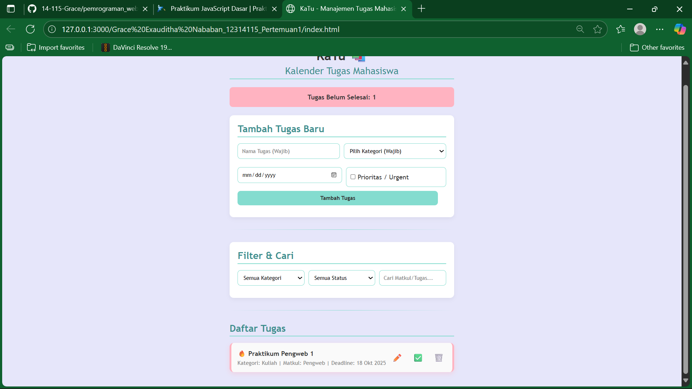
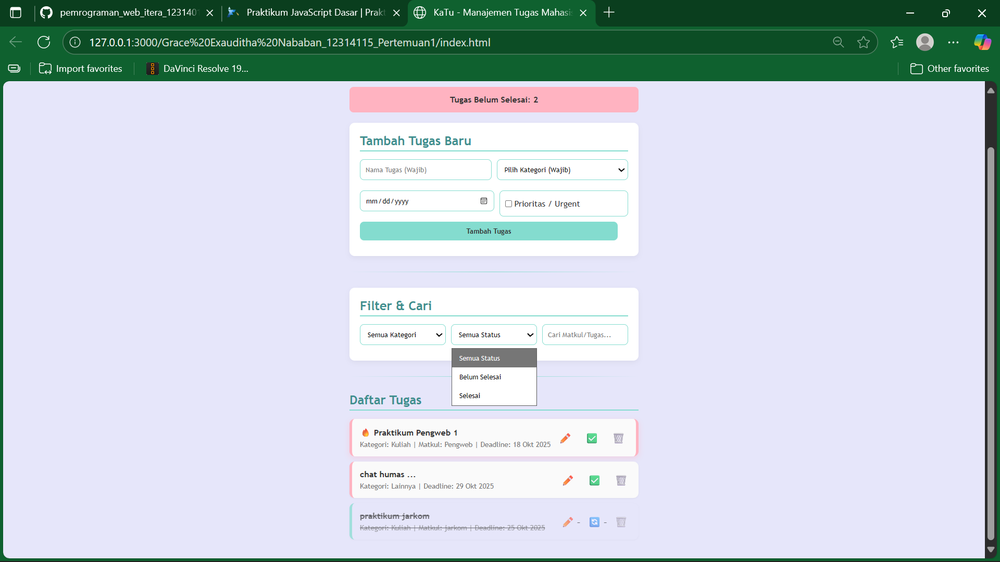

# KaTu 📚 - Sistem Manajemen Tugas Mahasiswa

## 🌟 Deskripsi Aplikasi

**KaTu** (Kalender Tugas) merupakan aplikasi web berbasis JavaScript sederhana yang dirancang untuk membantu mahasiswa dalam mengelola, melacak, dan memprioritaskan tugas-tugas akademik maupun non-akademik secara efisien. Aplikasi ini memastikan bahwa semua *deadline* dapat dipantau dengan baik, sehingga meminimalkan risiko keterlambatan pengumpulan tugas.

**Fungsionalitas Utama:**
1.  **Entri Data:** Memasukkan detail tugas lengkap (Nama, Kategori, Mata Kuliah, Tenggat Waktu, dan status Prioritas).
2.  **Penyimpanan Persisten:** Data tugas disimpan secara lokal di peramban (*browser*) pengguna menggunakan **`localStorage`**.
3.  **Filtrasi dan Pencarian:** Menyediakan mekanisme penyaringan berdasarkan status penyelesaian, kategori, dan pencarian berbasis teks.
4.  **Sistem Prioritas:** Penandaan tugas sebagai *Urgent* (Prioritas) yang memengaruhi urutan tampilan.

## 📸 Tampilan Antarmuka (Screenshots)

Berikut adalah beberapa tangkapan layar untuk mengilustrasikan fungsi dan antarmuka KaTu:

| Tampilan Awal (Kosong) | Tampilan Tugas dengan Prioritas | Filter Status Dibuka |
| :---: | :---: | :---: |
|  |  |  |

---

## 🚀 Panduan Pengoperasian Aplikasi (Run Locally)

Aplikasi ini bersifat *client-side* dan tidak memerlukan *server* eksternal untuk menjalankannya.

1.  **Kloning Repositori:**
    * Buka **Terminal** atau **Command Prompt** (CMD).
    * Kloning proyek dari repositori GitHub berikut:
        ```bash
        git clone https://github.com/14-115-Grace/pemrograman_web_itera_123140115.git
        ```
    * Masuk ke direktori repositori (ini terjadi otomatis setelah clone):
        ```bash
        cd pemrograman_web_itera_123140115
        ```
    * Pindah ke sub-direktori tempat *file* aplikasi berada:
        ```bash
        cd "Grace Exauditha Nababan_12314115_Pertemuan1" 
        ```
2.  **Eksekusi:** Buka berkas **`index.html`** dengan mengeklik dua kali atau membukanya melalui peramban web (Google Chrome, Firefox, dll.).

---

## ✨ Fitur-Fitur Terimplementasi

Daftar fitur yang telah diimplementasikan dalam KaTu:

* **Manajemen CRUD (Create, Read, Update, Delete):** Fungsionalitas lengkap untuk menambah, menampilkan, mengubah detail (nama, mata kuliah, tenggat waktu, prioritas), dan menghapus tugas.
* **Penandaan Status:** Kemampuan untuk mengubah status tugas menjadi **Selesai** (✅) atau **Belum Selesai** (🔄).
* **Mekanisme Penyortiran Otomatis:** Daftar tugas diurutkan berdasarkan hirarki berikut: **Tugas Prioritas (Urgent)** > **Tugas Belum Selesai** > **Tenggat Waktu Terdekat**.
* **Tampilan Status Visual:** Tugas Prioritas ditandai dengan ikon **🔥** dan *border* khusus, sementara tugas yang sudah Selesai ditandai dengan efek *line-through*.
* **Pelaporan Real-time:** Menampilkan jumlah tugas yang **Belum Selesai** secara dinamis pada *header* aplikasi.

---

## 🧠 Analisis Teknis Utama

### 1. Penggunaan `localStorage` untuk Data Persisten

Aplikasi KaTu memanfaatkan API `localStorage` pada peramban untuk menjamin data tugas tetap tersimpan setelah peramban ditutup atau halaman dimuat ulang.

* **Penyimpanan Data:** Fungsi `saveTasks()` melakukan serialisasi *array* JavaScript berisi objek tugas menjadi *string* JSON menggunakan metode **`JSON.stringify()`** sebelum disimpan ke `localStorage`.
* **Pemuatan Data:** Fungsi `loadTasks()` mengambil *string* JSON tersimpan dan melakukan deserialisasi kembali menjadi *array* objek JavaScript menggunakan metode **`JSON.parse()`** saat aplikasi diinisialisasi.

### 2. Validasi Formulir dan Deadline

Validasi diterapkan untuk menjamin integritas data dan mencegah kesalahan input:

* **Validasi Wajib Isi:** Memastikan kolom **Nama Tugas** dan **Kategori** tidak kosong.
* **Validasi Tenggat Waktu (Deadline):** Tenggat waktu yang dimasukkan harus merupakan tanggal yang valid dan **tidak boleh berada di masa lalu**. Pengecekan dilakukan dengan membandingkan tanggal input dengan tanggal hari ini.
